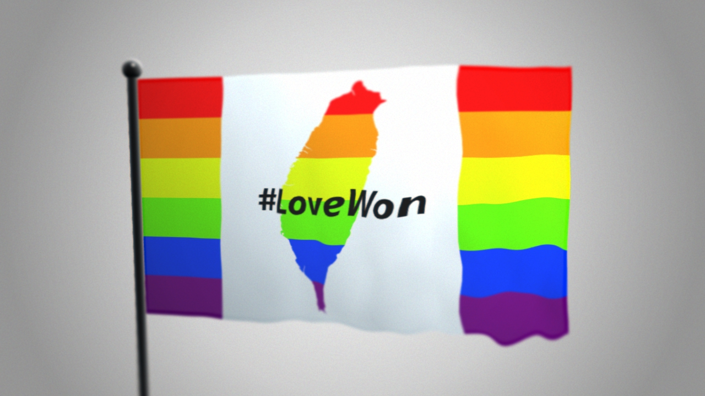

# Taiwan-LoveWon

<meta property="og:title" content="TD-Workshops:Taiwan-LoveWon by yeataro@github">
<meta property="og:description" content="Test for metadata.">
<meta property="og:image" content="https://yeataro.github.io/TD-Workshops/Taiwan-LoveWon/Tutorial/screenshots/bg.jpeg">
<meta property="og:url" content="https://yeataro.github.io/TD-Workshops/Taiwan-LoveWon/Tutorial/screenshots/bg.jpeg">
<meta name="twitter:card" content="summary_large_image">

In commemoration of Taiwan legalizes same-sex marriage in historic first for Asia, the content of this tutorial is how to create a rainbow flag like the one in the picture. The tutorial is for the Taiwanese community, so it is traditional Han language.

